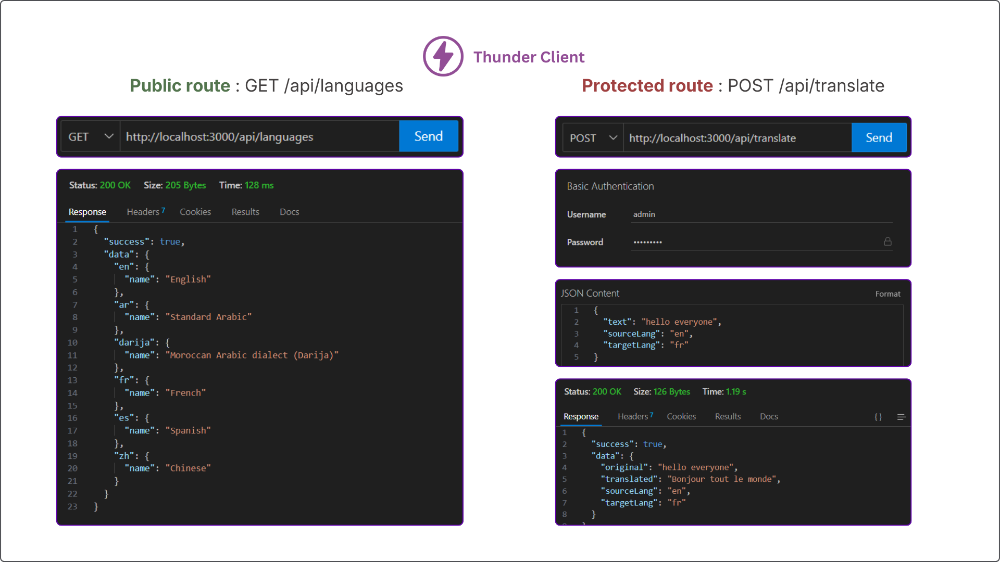
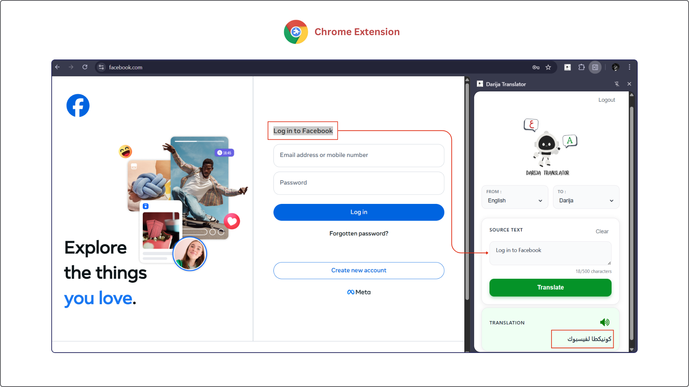

# Project N°1 - LLM Powered Translation App

This project focuses on developing an LLM-based application, which involves creating a RESTful web service to be accessed by two client platforms: a web/mobile app built with the technology of our choice and a Chrome extension for enhanced flexibility and ease of use.

In this README file, I will provide an overview of the project, outline the technologies used, describe the implemented features, and offer a step-by-step guide on how to install and run the application locally.

## Project Overview

This project provides translation services from multiple languages using an LLM model, integrating 3 main components:

| Component | Technologies Used |
|-----------|------------------|
| **Backend (API)** | Node.js, Express, Gemini AI API |
| **Frontend (Web & Mobile App)** | React Native, Expo |
| **Frontend (Extension)** | HTML, CSS, JavaScript, Manifest V3 |

**Extra Components:**

| Component | Tools/APIs Used |
|-----------|----------------|
| **Testing** | Postman, Thunder Client |
| **Backend Communication** | Fetch API |
| **Text-to-Speech (Web)** | Speech Synthesis Browser API |
| **Text-to-Speech (Mobile)** | Expo Speech Library |

## Architecture

The project follows a **client-server** architecture where three frontend clients (Web, Mobile, and Extension) consume the backend API (Node.js server) via HTTP requests using the **Fetch API**. The backend communicates with the **Gemini AI model** by building and sending prompts, then returns the translation response to the clients. The API is **secured** with **authentication**, meaning translation can only be performed if the user is authenticated correctly.


## (1) Backend API

The backend is a RESTful API built with Node.js and Express that handles translation requests.

**Key Features:**
- **Basic Authentication**: Secures the API endpoints using username:password authentication
- **Two Routes Exposed:**
  - **Public Route**: `GET /languages` - Returns all supported languages
  - **Protected Route**: `POST /translate` - Performs translation (requires authentication)
- **Gemini AI Model**: Gemini is used for its free tier and accessibility. and i specifically chose **Gemini Flash 2.5** because it provides the most accurate translation results and has reasonable usage limits, making it perfect for simple projects like this.

## Testing the API

I tested my API using two tools to ensure everything works correctly:

**1. Postman**  
I first tested my API using Postman to verify both the public and protected routes.


**2. Thunder Client**  
I then moved to using Thunder Client, which is a REST client integrated directly into VS Code for easier and faster testing during development.



## Web & Mobile App

I used **React Native** for building a cross-platform application that works on both web and mobile devices, and **Expo** for streamlined development and configuration.

**Key Features:**
- **Text-to-Speech Functionality:**
  - **Mobile**: Expo Speech library
  - **Web**: Speech Synthesis Browser API
- **Backend Communication**: Fetch API to communicate with the backend
- **Dark Mode & Responsive Design**: Added for a smooth & intuitive user experience across all devices


## Chrome Extension

A lightweight browser extension with a side panel interface for quick translations.

**Key Features:**
- **Side Panel UI**: Clean interface built with HTML and CSS
- **Text-to-Speech Functionality**: Speech Synthesis Browser API
- **Manifest V3**: Using the latest Chrome extension standard for better security and performance
- **Backend Communication**: Fetch API to communicate with the backend API



## 🚀 How to Install and Run the Project

### Clone the Repository

First, clone the project to your local machine:
```bash
git clone https://github.com/salma-elbakkouri/Darija-Translator.git
cd Darija-Translator
```

### Prerequisites
- VS code
- Node.js
- Expo Go app (for mobile testing)
- Gemini API key ([Get one here](https://makersuite.google.com/app/apikey))

### API Setup

1. Navigate to the API folder:
```bash
cd API
```

2. Create your environment file:
```bash
cp .env.example .env
```

3. Edit `.env` and add your credentials:
```env
PORT=3000
GEMINI_API_KEY=your_actual_api_key_here
AUTH_USERS=admin:salma,user2:password2
```

4. Install dependencies:
```bash
npm install
```

5. Start the server:
```bash
npm start
```

The API will run on `http://localhost:3000`

### Mobile App Setup

1. Navigate to the Mobile folder:
```bash
cd Mobile
```

2. Install dependencies:
```bash
npm install
```

3. Start the development server:
```bash
npx expo start
```

4. Run the app:
   - **On your phone**: Install Expo Go app and scan the QR code
   - **On web**: Press `w` in the terminal

### Chrome Extension Setup

1. Open Chrome and navigate to `chrome://extensions/`

2. Enable "Developer mode" (toggle in top-right corner)

3. Click "Load unpacked" and select the `Extension` folder

4. The extension will appear in your browser toolbar

5. Click the extension icon to open the side panel

## 📝 Notes

- `node_modules` folders are excluded from the repository (install via `npm install`)
- `.env` files are excluded for security (create your own `.env` file and use `.env.example` as a template)

---

**Developed by Salma El Bakkouri** - MQL - Generative AI Project N°1